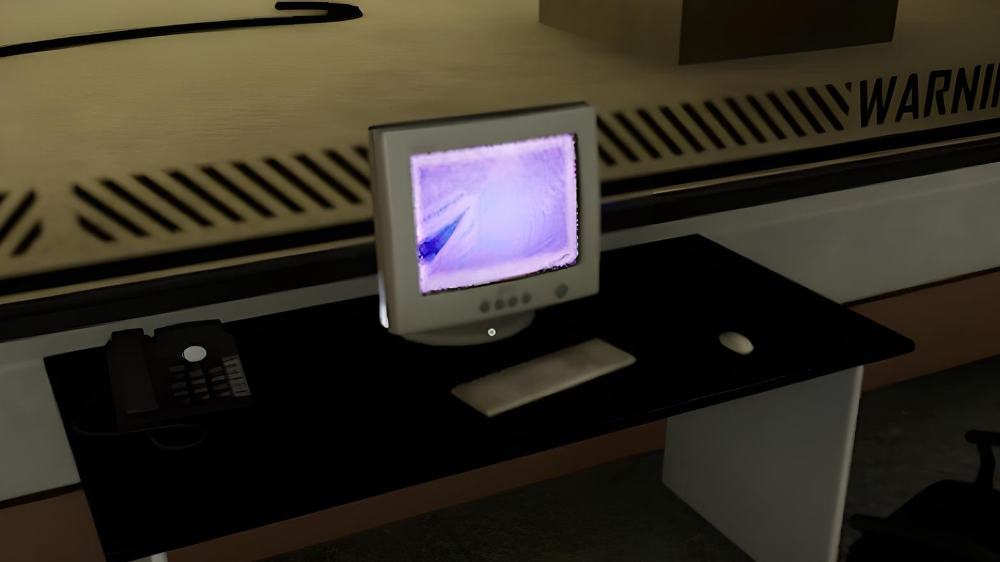

<a name="readme-top">

<br/>

<br />
<div align="center">
  <a href="https://github.com/zyx-0314/">
  <!-- TODO: If you want to add logo or banner you can add it here -->
    
  </a>
<!-- TODO: Change Title to the name of the title of your Project -->
  <h3 align="center">Headers and Footers Design</h3>
</div>


<br />

<!-- TODO: Change the zyx-0314 into your github username  -->
<!-- TODO: Change the WD-Template-Project into the same name of your folder -->


---

<br />
<br />

<!-- TODO: If you want to add more layers for your readme -->
<details>
  <summary>Table of Contents</summary>
  <ol>
    <li>
      <a href="#overview">Overview</a>
      <ol>
        <li>
          <a href="#key-components">Key Components</a>
        </li>
        <li>
          <a href="#technology">Technology</a>
        </li>
      </ol>
    </li>
    <li>
      <a href="#rule,-practices-and-principles">Rules, Practices and Principles</a>
    </li>
    <li>
      <a href="#resources">Resources</a>
    </li>
  </ol>
</details>

---

## Overview

<!-- TODO: To be changed -->
<!-- The following are just sample -->
Backrooms inspired landing headers and footers design and other website design themes.

Guiding Question:

- What is the project
The project is a web design demonstration for headers and footers layout design.
- Whats the purpose
To showcase 5 static headers and footers design and 5 animated headers and footers design.
- What are key components
Showcases uniquely designed elements with different font styling and creative display. Some headers feature a call to action and a search bar.
- What technology used and how it is used
HTML and CSS were used in this project.

### Key Components
<!-- TODO: List of Key Components -->
<!-- The following are just sample -->
- Landing Page with dynamic animations.
- Static and Animated header designs.
- Static and Animated footer designs.

### Technology
<!-- TODO: List of Technology Used -->


## Rules, Practices and Principles

1. Always use `WD-` in the front of the Title of the Project for the Subject followed by your custom naming.
2. Do not rename any .html files; always use `index.html` as the filename.
3. Place Files in their respective folders.
4. All file naming are in camel case.
   - Camel case is naming format where there is no white space in separation of each words, the first word is in all lower case while the succeding words first letter are in upper followed by lower cased letters.
   - ex.: buttonAnimatedStyle.css
5. Use only `External CSS`.
6. Renaming of Pages folder names are a must, and relates to what it is doing or data it holding.
7. File Structure to follow below.

```
WD-ProjectName
└─ assets
|   └─ css
|   |   └─ style.css
|   └─ img
|   |   └─ fileWith.jpeg/.jpg/.webp/.png
|   └─ js
|       └─ script.js
└─ pages
|  └─ pageName
|     └─ assets
|     |  └─ css
|     |  |  └─ style.css
|     |  └─ img
|     |  |  └─ fileWith.jpeg/.jpg/.webp/.png
|     |  └─ js
|     |     └─ script.js
|     └─ index.html
└─ index.html
└─ readme.md
```

## Resources

<!-- TODO: Add References -->
| Title | Purpose | Link |
|-|-|-|
| W3Schools | HTML, CSS Reference | <https://www.w3schools.com>
| Backrooms Computer | Image | <https://escapethebackrooms.fandom.com/wiki/Computer_(The_Hub)?file=HubComputer.png>
| Error Text Effect | For Font Styling | <https://codepen.io/guidipolito/pen/abMEYBB>
| Computer desktop overlay | Container overlay | <https://i.pinimg.com/originals/d7/af/7f/d7af7f98b301bbc84bf26c402ca95453.jpg>
| Free Flower pack | Header one design icons | <https://karsiori.itch.io/free-pixel-art-flower-pack>
| Pixeloid Sans font | Header one font | <https://www.dafont.com/pixeloid-sans.font>
| Montserrat | Header three font | <https://fonts.google.com/specimen/Montserrat>
| Malfunctional Metropolis | Image for Header three | <https://backrooms.fandom.com/wiki/Level_111?file=Malsquare.png>
| Playfair Display | Header four font | <https://fonts.google.com/specimen/Playfair+Display>
| Building logo | h3 logo | https://in.pinterest.com/pin/822118106970375106/ |
| Shopping Logo | h4 logo | https://as2.ftcdn.net/v2/jpg/03/34/53/51/1000_F_334535136_vvbWaKEpsHIMS4dpJUxgXZL6clQX7VGs.jpg |
| Creating a searchbar | Search bar | https://www.w3schools.com/howto/howto_css_searchbar.asp |
